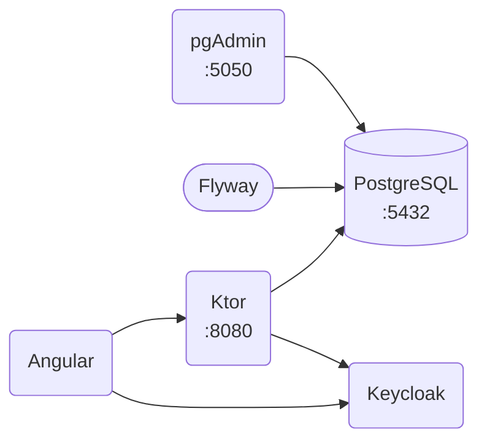

# Ročníkový projekt
Noemi Dvořáková (st69601@upce.cz),
Jiří Hejduk (st52927@upce.cz),
Klára Kahounová (st69615@upce.cz),
Klára Pantůčková (st69635@upce.cz)

---

## Technologie
| Název      | Verze  | Popis              | Odkaz                                     |
|------------|--------|--------------------|-------------------------------------------|
| Kotlin     | 2.4.20 | programovací jazyk | https://kotlinlang.org/                   |
| Ktor       | 3.6.0  | HTTP framework     | https://ktor.io/                          |
| PostgreSQL | 18.6   | relační databáze   | https://www.postgresql.org/               |
| pgAdmin    | 9.18   | správa databáze    | https://www.pgadmin.org/                  |
| Flyway     | 13.8   | migrace databáze   | https://www.red-gate.com/products/flyway/ |
| Angular    | 21.2   | frontend           | https://angular.dev/                      |

---

