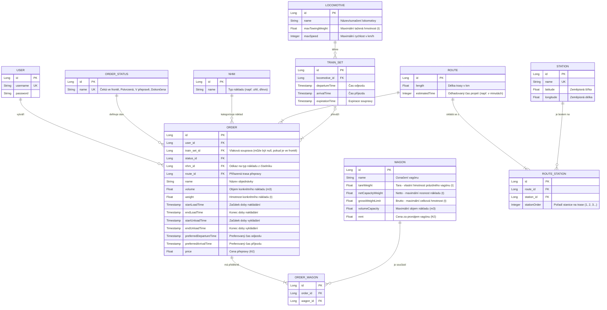

# Databáze

## Databázový model

```mermaid
    erDiagram

    ORDER {
        Long id PK
        Long user_id FK
        Long train_set_id FK "Vlaková souprava (může být null, pokud je ve frontě)"
        Long status_id FK
        Long nhm_id FK "Odkaz na typ nákladu z číselníku"
        Long route_id FK "Přiřazená trasa přepravy"
        String name "Název objednávky"
        Float volume "Objem konkrétního nákladu (m3)"
        Float weight "Hmotnost konkrétního nákladu (t)"
        Timestamp startLoadTime "Začátek doby nakládání"
        Timestamp endLoadTime "Konec doby nakládání"
        Timestamp startUnloadTime "Začátek doby vykládání"
        Timestamp endUnloadTime "Konec doby vykládání"
        Timestamp preferredDepartureTime "Preferovaný čas odjezdu"
        Timestamp preferredArrivalTime "Preferovaný čas příjezdu"
        Float price "Cena přepravy (Kč)"
    }
    
    USER {
        Long id PK
        String username UK
        String password
    }

    WAGON {
        Long id PK
        String name "Označení vagónu"
        Float tareWeight "Tara - vlastní hmotnost prázdného vagónu (t)"
        Float netCapacityWeight "Netto - maximální nosnost nákladu (t)"
        Float grossWeightLimit "Brutto - maximální celková hmotnost (t)"
        Float volumeCapacity "Maximální objem nákladu (m3)"
        Float rent "Cena za pronájem vagónu (Kč)"
    }

    ORDER_WAGON {
        Long id PK
        Long order_id FK
        Long wagon_id FK
    }

    LOCOMOTIVE {
        Long id PK
        String name "Název/označení lokomotivy"
        Float maxTowingWeight "Maximální tažená hmotnost (t)"
        Integer maxSpeed "Maximální rychlost v km/h"
    }

    TRAIN_SET {
        Long id PK
        Long locomotive_id FK
        Timestamp departureTime "Čas odjezdu"
        Timestamp arrivalTime "Čas příjezdu"
        Timestamp expirationTime "Expirace soupravy"
    }


    STATION {
        Long id PK
        String name UK
        Float latitude "Zeměpisná šířka"
        Float longitude "Zeměpisná délka"
    }

    ROUTE {
        Long id PK
        Float length "Délka trasy v km"
        Integer estimatedTime "Odhadovaný čas projetí (např. v minutách)"
    }

    ROUTE_STATION {
        Long id PK
        Long route_id FK
        Long station_id FK
        Integer stationOrder "Pořadí stanice na trase (1, 2, 3...)"
    }

    NHM {
        Long id PK
        String name "Typ nákladu (např. uhlí, dřevo)"
    }

    ORDER_STATUS {
        Long id PK
        String name UK "Čeká ve frontě, Potvrzená, V přepravě, Dokončena"
    }


%% Vztahy

%% USER má nula až víc ORDER. ORDER má právě jednoho USER.
    USER ||--o{ ORDER : "vytváří"

%% LOCOMOTIVE má nula až víc TRAIN SET. TRAIN SET má vždy jednu LOCOMOTIVE.
    LOCOMOTIVE ||--o{ TRAIN_SET : "táhne"

%% ROUTE má dvě až více stanic (značeno jako 1..N), STATION má nula až více ROUTE
    ROUTE ||--|{ ROUTE_STATION : "skládá se z"
    STATION ||--o{ ROUTE_STATION : "je bodem na"

%% ORDER má právě jeden ORDER STATUS. ORDER STATUS má nula až více ORDER.
    ORDER_STATUS ||--o{ ORDER : "definuje stav"

%% NHM má nula nebo více ORDER. ORDER má právě jednu NHM.
    NHM ||--o{ ORDER : "kategorizuje náklad"

%% ORDER má právě jednu ROUTE. ROUTE má jednu až víc ORDER.
    ROUTE ||--|{ ORDER : "je naplánována pro"

%% ORDER má jeden až více WAGON a WAGON má nula až více ORDER
    ORDER ||--|{ ORDER_WAGON : "má přidělené"
    WAGON ||--o{ ORDER_WAGON : "je součástí"

%% TRAIN SET má jedna až více ORDER, ORDER má nula až jeden TRAIN SET.
    TRAIN_SET |o--|{ ORDER : "převáží"
```
