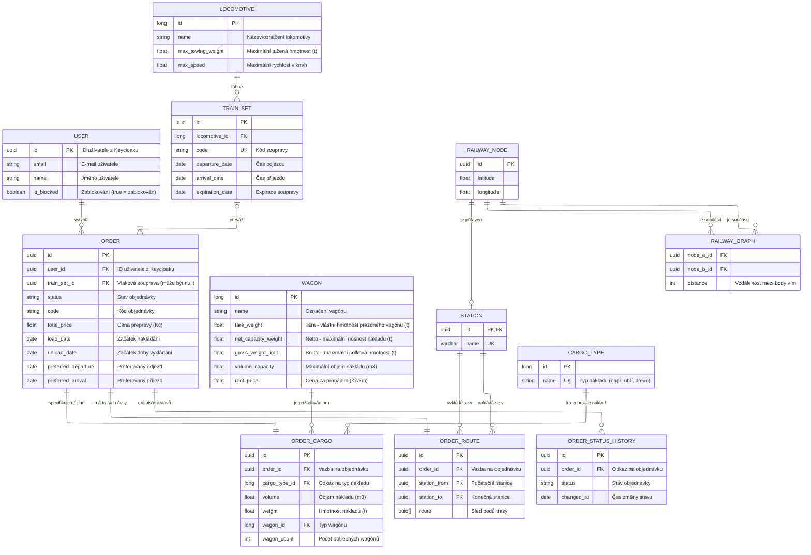

# Databáze

## Databázový model

```mermaid
    %%{init: {"layout": "elk"}}%%
    erDiagram

    ORDER {
        uuid id PK
        uuid user_id FK "ID uživatele z Keycloaku"
        uuid train_set_id FK "Vlaková souprava (může být null)"
        string status "Stav objednávky"
        string code "Kód objednávky"
        float total_price "Cena přepravy (Kč)"
        date load_date "Začátek nakládání"
        date unload_date "Začátek doby vykládání"
        date preferred_departure "Preferovaný odjezd"
        date preferred_arrival "Preferovaný příjezd"
    }

    ORDER_CARGO {
        uuid id PK
        uuid order_id FK "Vazba na objednávku"
        long cargo_type_id FK "Odkaz na typ nákladu"
        float volume "Objem nákladu (m3)"
        float weight "Hmotnost nákladu (t)"
        long wagon_id FK "Typ wagónu"
        int wagon_count "Počet potřebných wagónů"
    }

    ORDER_ROUTE {
        uuid id PK
        uuid order_id FK "Vazba na objednávku"
        uuid station_from FK "Počáteční stanice"
        uuid station_to FK "Konečná stanice"
        uuid[] route "Sled bodů trasy"
    }
    
    USER{
        uuid id PK "ID uživatele z Keycloaku"
        string email "E-mail uživatele"
        string name "Jméno uživatele"
        boolean is_blocked "Zablokování (true = zablokován)"
    }

    ORDER_STATUS_HISTORY {
        uuid id PK
        uuid order_id FK "Odkaz na objednávku"
        string status "Stav objednávky"
        date changed_at "Čas změny stavu"
    }

    WAGON {
        long id PK
        string name "Označení vagónu"
        float tare_weight "Tara - vlastní hmotnost prázdného vagónu (t)"
        float net_capacity_weight "Netto - maximální nosnost nákladu (t)"
        float gross_weight_limit "Brutto - maximální celková hmotnost (t)"
        float volume_capacity "Maximální objem nákladu (m3)"
        float rent_price "Cena za pronájem (Kč/km)"
    }

    LOCOMOTIVE {
        long id PK
        string name "Název/označení lokomotivy"
        float max_towing_weight "Maximální tažená hmotnost (t)"
        float max_speed "Maximální rychlost v km/h"
    }

    TRAIN_SET {
        uuid id PK
        long locomotive_id FK
        string code UK "Kód soupravy"
        date departure_date "Čas odjezdu"
        date arrival_date "Čas příjezdu"
        date expiration_date "Expirace soupravy"
    }

    STATION {
        uuid id PK, FK
        varchar name UK
    }

    CARGO_TYPE {
        long id PK
        string name UK "Typ nákladu (např. uhlí, dřevo)"
    }

    RAILWAY_GRAPH {
        uuid node_a_id FK
        uuid node_b_id FK
        int distance "Vzdálenost mezi body v m"
    }

    RAILWAY_NODE {
        uuid id PK
        float latitude
        float longitude
    }


%% Vztahy

%% ROUTE má dvě až více stanic (značeno jako 1..N), STATION má nula až více ROUTE
    STATION ||--o{ ORDER_ROUTE : "nakládá se v"
    STATION ||--o{ ORDER_ROUTE : "vykládá se v"

%% LOCOMOTIVE má nula až víc TRAIN SET. TRAIN SET má vždy jednu TRAIN.
    LOCOMOTIVE ||--o{ TRAIN_SET : "táhne"

    RAILWAY_NODE ||--o{ RAILWAY_GRAPH : "je součástí"
    RAILWAY_NODE ||--o{ RAILWAY_GRAPH : "je součástí"
    RAILWAY_NODE ||--o| STATION : "je přiřazen"

%% Historie stavů objednávky má nula až více ORDER_STATUS_HISTORY.
    ORDER ||--o{ ORDER_STATUS_HISTORY : "má historii stavů"

%% ORDER má nula až více ORDER_CARGO. ORDER_CARGO má právě jednoho ORDER.
    ORDER ||--|| ORDER_CARGO : "specifikuje náklad"
    ORDER ||--|| ORDER_ROUTE : "má trasu a časy"

%% User má nula až více ORDER. ORDER má právě jednoho USER.
    USER ||--o{ ORDER : "vytváří"

%% TRAIN SET má jedna až více ORDER, ORDER má nula až jeden TRAIN SET.
    TRAIN_SET |o--|{ ORDER : "převáží"

%% CARGO_TYPE má nula nebo více ORDER. ORDER má právě jednu CARGO_TYPE.
    CARGO_TYPE ||--o{ ORDER_CARGO : "kategorizuje náklad"
    WAGON ||--o{ ORDER_CARGO : "je požadován pro"
```

